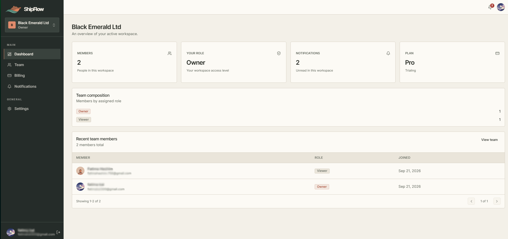

# ShipFlow

ShipFlow is a multi-tenant SaaS starter built with a NestJS API and a React 19 frontend. The [public demo](https://shipflow-duk.pages.dev) lets a reviewer sign in with Google or GitHub, create or join organizations, manage team roles, enable authenticator-based 2FA, and explore Stripe test-mode billing.

This repository is a working reference implementation, not a hosted customer service. The public deployment is intentionally constrained to a zero-cost demo profile; see [what is and is not live](docs/case-study.md#demo-scope-and-limitations) before evaluating it.

## Architecture at a glance

| Layer               | Implementation                                                                                                                          |
| ------------------- | --------------------------------------------------------------------------------------------------------------------------------------- |
| Frontend            | React 19, TypeScript, Vite, Tailwind CSS v4, TanStack Query, Zustand, React Hook Form, Zod, and generated OpenAPI types                 |
| API                 | NestJS, TypeScript, versioned REST endpoints, capability-based RBAC, and Swagger/OpenAPI                                                |
| Data                | PostgreSQL 18, Prisma migrations, organization-scoped membership and billing records                                                    |
| Identity            | Google/GitHub OAuth, Argon2id password support in standard mode, short-lived JWT access tokens, rotating refresh sessions, and TOTP 2FA |
| Billing             | Stripe Checkout, Customer Portal, signed webhooks, and organization-level entitlements                                                  |
| Public demo hosting | Cloudflare Pages with a same-origin API proxy, Render, and Neon                                                                         |

The API enforces tenant membership and capabilities; frontend visibility is not an authorization boundary. Stripe remains the payment source of truth, while the API reads locally synchronized entitlement state for application requests.

## Explore

- [Technical case study](docs/case-study.md) — design decisions, security boundaries, testing, deployment, and a verified product walkthrough.
- [Public-demo deployment guide](docs/deployment.md) — environment profile, proxy, OAuth, Stripe, and health checks.
- [Remaining commercial-release work](docs/remaining-work.md) — repository-audited blockers and the definition of v1 completion.
- [Backend setup and API](backend/README.md) and [frontend setup](frontend/README.md).
- [Security architecture](backend/docs/security.md) and [GitHub Actions workflow](.github/workflows/ci.yml).

The `public-demo` profile permits OAuth account creation and live Stripe **test-mode** checkout. Password registration/recovery, file APIs, and the Resend webhook are blocked at the API boundary. Resend email delivery, private R2 storage, and ClamAV scanning are implemented for the standard architecture but are not provisioned or usable in this public deployment. Do not enter real payment information; use Stripe test cards only.
