# ShipFlow — technical case study

## The project

ShipFlow is a decoupled SaaS starter designed to make common application boundaries explicit: identity, organizations, permissions, billing, notifications, and file lifecycle. A React 19 client consumes a versioned NestJS REST API through generated OpenAPI types. PostgreSQL stores durable application state, with Prisma migrations defining the schema.

[Open the public demo](https://shipflow-duk.pages.dev) · [Read the deployment runbook](deployment.md) · [Review the CI workflow](../.github/workflows/ci.yml)

## Architecture and trade-offs

The browser hosts the React application on Cloudflare Pages. For the public demo, a Pages Function forwards `/api/v1/*` to the Render-hosted API, so browser requests and OAuth callback cookies remain on the same Pages origin. The function is a transport proxy, not an authorization layer: NestJS validates sessions, tenant membership, capabilities, and request input. Stripe sends signed webhooks directly to Render. Neon hosts PostgreSQL; the demo's Docker image applies pending migrations at startup because Render Free lacks a pre-deploy command.

The client keeps short-lived access tokens in memory and uses a backend-managed HttpOnly refresh cookie. TanStack Query owns server state; Zustand holds the current in-memory session and active organization. Typed OpenAPI generation reduces client/API drift. This deployment is intentionally single-instance and uses in-memory rate limiting; it is not presented as a production-availability design.

## Tenant isolation and permissions

Organizations own memberships, invitations, billing, and other tenant data. Every organization-scoped request resolves the authenticated user and membership before reaching its service. An inaccessible tenant returns `404`; a member who lacks a required capability receives `403`. The role matrix covers Owner, Admin, Member, and Viewer, with billing limited to Owners and hierarchy rules for membership changes. The UI uses the returned capabilities to show appropriate controls, but the backend remains authoritative. A user can switch between organizations with distinct memberships and plan states.

Invitations are tied to the invited email address. In the public demo, an authorized inviter receives a shareable URL at creation or resend time; the raw invitation token is not retained or exposed in the invitation list. A signed-out invitee can authenticate through OAuth and return to the invitation.

## Authentication and second factor

Google and GitHub OAuth use signed, one-time state cookies. Password accounts are supported in the standard profile, with Argon2id password hashing. Access JWTs are short-lived; refresh tokens are opaque, hashed at rest, rotated on use, and revoked by family if reuse is detected.

If 2FA is enabled, either password or OAuth first-factor authentication produces a five-minute challenge rather than a session. Only a valid TOTP or single-use recovery code completes sign-in. TOTP secrets are encrypted at rest; recovery codes are displayed once and stored as hashes. The public demo has been exercised with both OAuth providers, TOTP, and a recovery code. It offers OAuth-only account creation because password registration and recovery are disabled in that deployment profile.

## Billing and webhook consistency

Each organization has its own Free or Pro billing state. An Owner starts Stripe test-mode Checkout and can manage the resulting subscription through Stripe's Customer Portal. The webhook endpoint verifies the raw-body signature, deduplicates event IDs, retrieves current subscription state, and updates the local subscription/entitlement record. Stripe is authoritative for payment events; PostgreSQL supplies request-time entitlements so normal API calls do not depend on a live Stripe round trip. The demo checkout, subscription, and delivered webhook events were verified in Stripe's sandbox.

## Testing and operations

Backend coverage uses Jest/Supertest, including PostgreSQL integration tests. Frontend coverage uses Vitest, React Testing Library, MSW, and Playwright. GitHub Actions runs validation, tests, builds, dependency audits, and a production Docker build; the [reviewed Phase 9 run passed](https://github.com/fatimakai/shipflow/actions/runs/35706100049). The public deployment uses Cloudflare Pages, Render, and Neon, with Render liveness monitored separately. Render Free can still restart or suspend, so a successful monitor check is not an uptime guarantee.

Security controls include backend-enforced RBAC, bounded DTO validation, Helmet, rate limiting, structured redacted logs, request IDs, and append-only audit records for security-sensitive operations. Details and limits are documented in the [security architecture](../backend/docs/security.md).

## Demo scope and limitations

| Capability                                                      | Public demo                                                         | Standard architecture                                                      |
| --------------------------------------------------------------- | ------------------------------------------------------------------- | -------------------------------------------------------------------------- |
| Google/GitHub OAuth, organizations, invitations, RBAC, TOTP 2FA | Available and exercised                                             | Available                                                                  |
| Stripe subscriptions and signed webhooks                        | Available in **test mode**; no real charges                         | Implemented; production setup requires live Stripe configuration           |
| Password registration, verification, and recovery               | Blocked by the API and omitted from public registration/recovery UI | Implemented                                                                |
| File APIs and file-usage controls                               | Blocked by the API and omitted from public-demo UI                  | Implemented with local development storage and an S3-compatible R2 adapter |
| Resend delivery and inbound webhook                             | Not provisioned; webhook blocked                                    | Implemented, requires a verified sending domain and provider configuration |
| Private R2 uploads and ClamAV scanning                          | Not provisioned or usable                                           | Implemented; requires private infrastructure and deployment verification   |

The public demo is not a substitute for the paid, production-ready deployment path in the [runbook](deployment.md). In particular, do not infer live email delivery or malware-scanned uploads from the repository implementation.

## Product walkthrough

The screenshots below were recaptured from the deployed public-demo profile after the presentation-specific controls were updated. Personal account details are obscured, and no credentials, invitation links, or recovery codes are shown.

### OAuth-focused sign-in

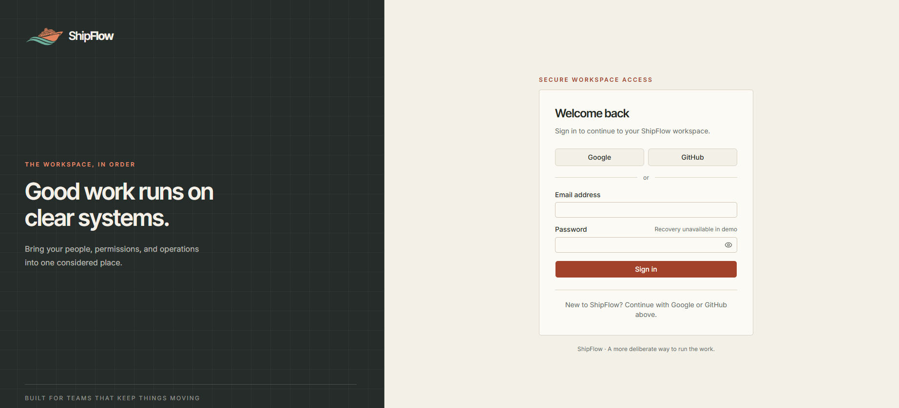

Google and GitHub are the public account-creation paths. Existing standard-profile password accounts can still sign in, but recovery is deliberately unavailable in this demo deployment.

### Second-factor challenge

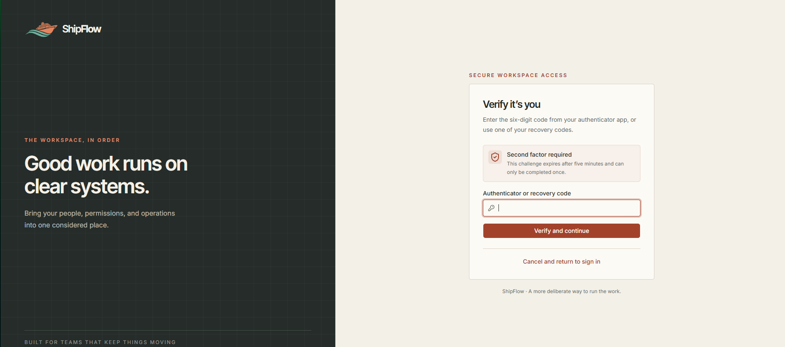

Password and OAuth first factors converge on the same five-minute TOTP or single-use recovery-code challenge.

### Multi-organization workspace

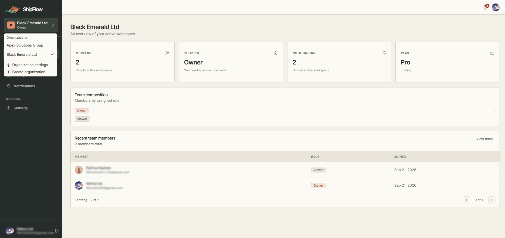

One account can move between separate organization workspaces, each with its own memberships, role, notifications, and billing state.

### Pro organization dashboard

The public-demo dashboard shows only live capabilities. File usage is omitted because file APIs are disabled at the demo's API boundary.

### Team management

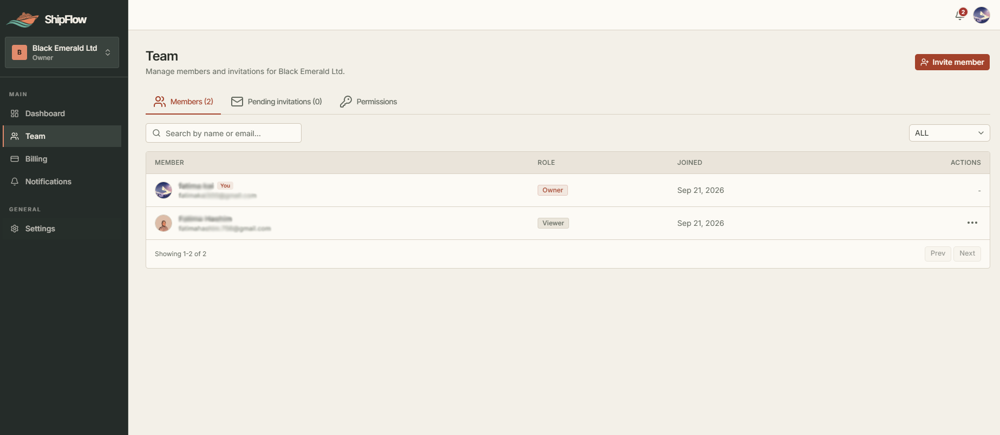

Organization managers can review members, invitations, and assigned roles without treating frontend controls as the authorization boundary.

### Role and capability matrix

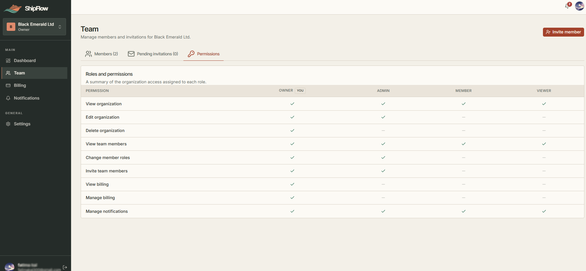

The matrix communicates the demo's organization, membership, billing, and notification capabilities. File rows are intentionally absent because that surface is unavailable in the public demo.

### Organization-scoped billing

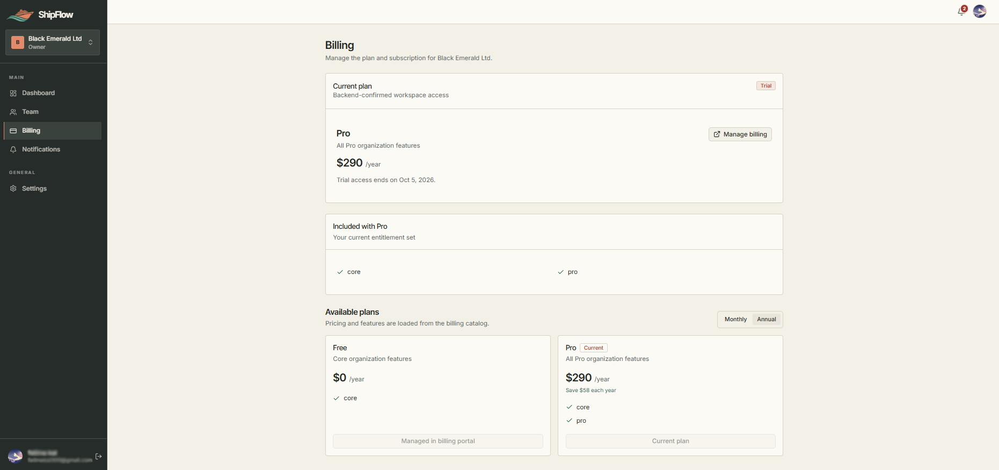

The selected organization is on a Stripe test-mode Pro annual trial and can open the hosted billing portal. Another organization can independently remain on Free.

### Account security

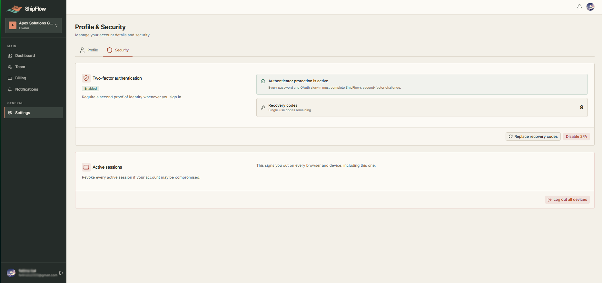

The security view confirms active authenticator protection, shows only the remaining recovery-code count, and provides all-session revocation. Password-reset controls are omitted in the public-demo profile.

## Verification evidence

- The [Phase 9 GitHub Actions run](https://github.com/fatimakai/shipflow/actions/runs/35706100049) passed both backend and frontend jobs.
- Stripe test-mode Checkout, the resulting Pro subscription, Customer Portal access, and signed webhook deliveries were exercised against the deployed application.
- The Cloudflare Pages site, Render API, same-origin proxy, and both liveness/readiness endpoints were smoke-tested after deployment.
- Google and GitHub OAuth, TOTP, a single-use recovery code, multi-organization switching, and a signed-out invitation acceptance flow were exercised manually.

### Continuous integration

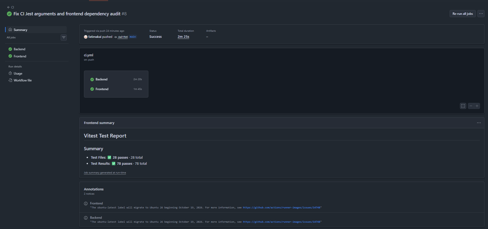

The repository keeps successful GitHub Actions runs as visible build evidence. This representative screenshot predates the final presentation-only change; the exact green Phase 9 run is linked above.

### Cloudflare Pages deployment

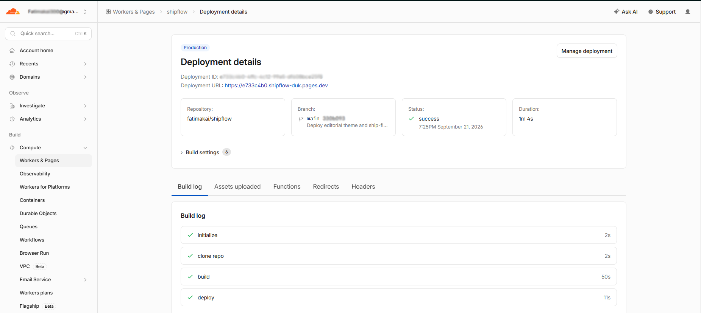

Cloudflare Pages builds the React application and deploys the static assets plus the same-origin API proxy Function. The screenshot shows a successful production deployment; the current public URL was smoke-tested separately after the Phase 9 release.

### Stripe webhook delivery

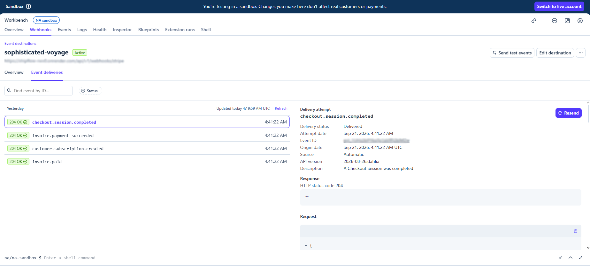

The sandbox recorded successful delivery of Checkout, subscription, and invoice events. Identifiers and destination details are obscured; event types, delivery state, and HTTP responses remain visible.

### Render API deployment

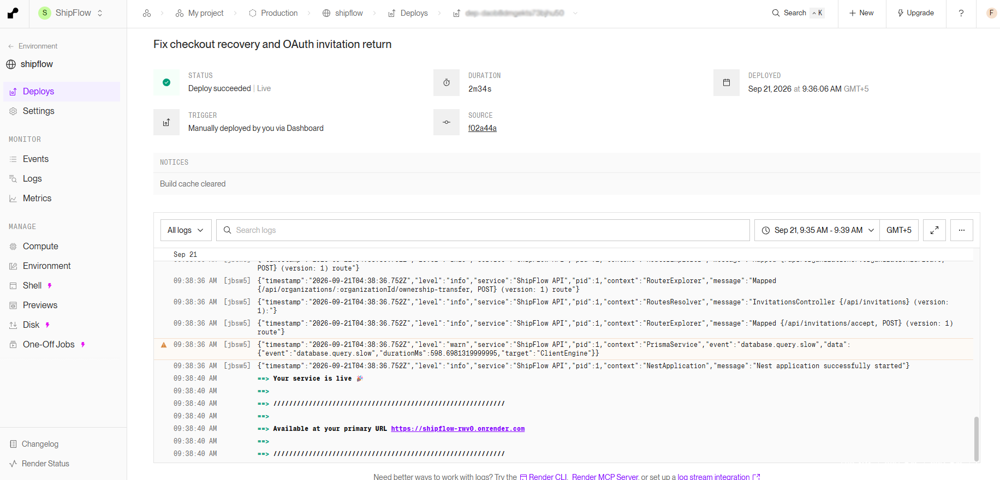

The backend Docker service started successfully on Render and exposed its primary API URL after registering the versioned routes.

### Liveness monitoring

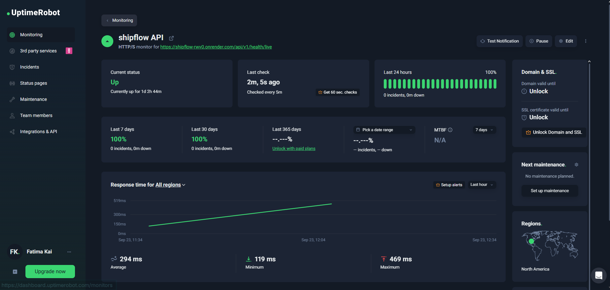

UptimeRobot checks the Render `/api/v1/health/live` endpoint every five minutes. The screenshot is a point-in-time operational check for the portfolio demo, not a formal uptime SLA.

These checks are release evidence, not a formal availability or security certification. Render Free can still restart or suspend, and the public demo intentionally excludes the provider infrastructure described in the limitations table.
